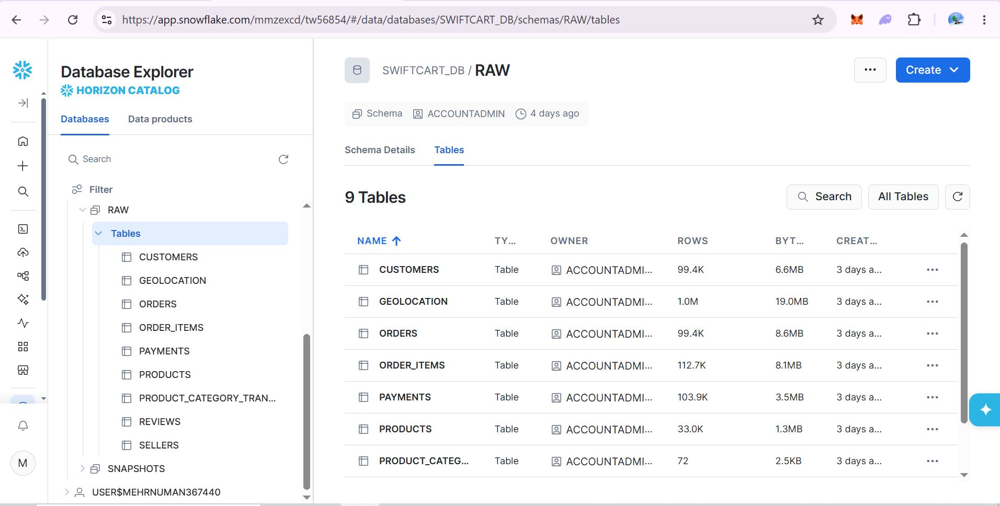
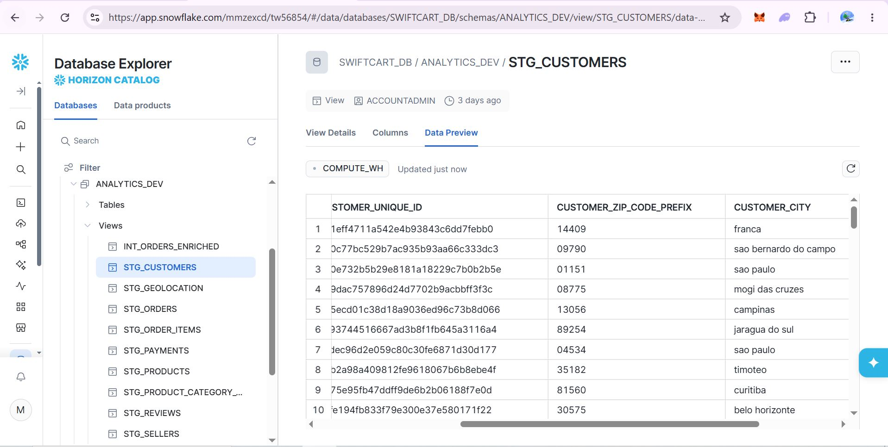
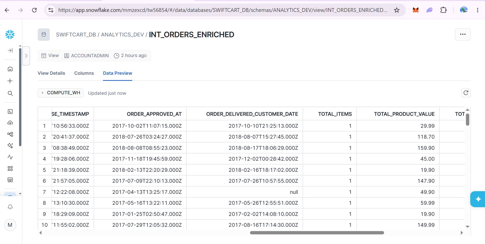
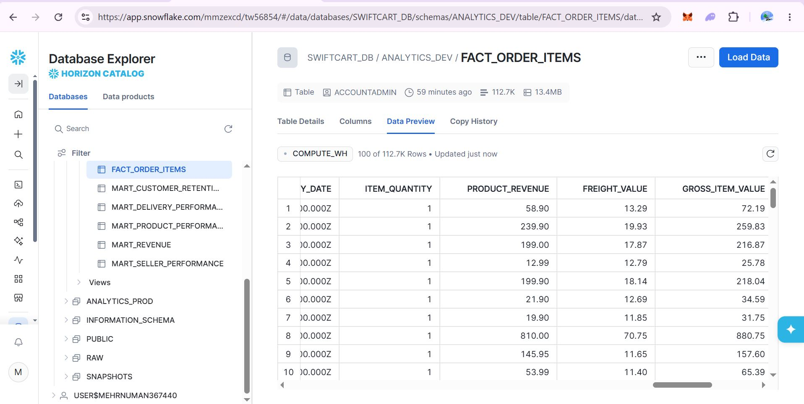
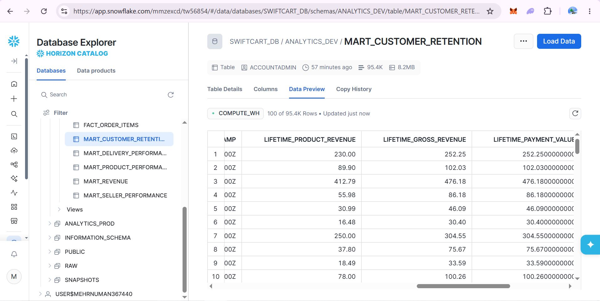
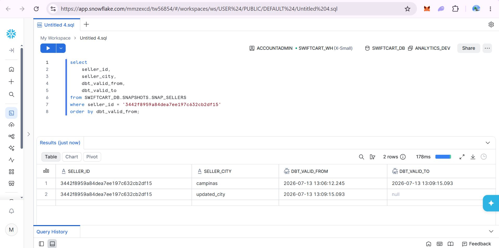
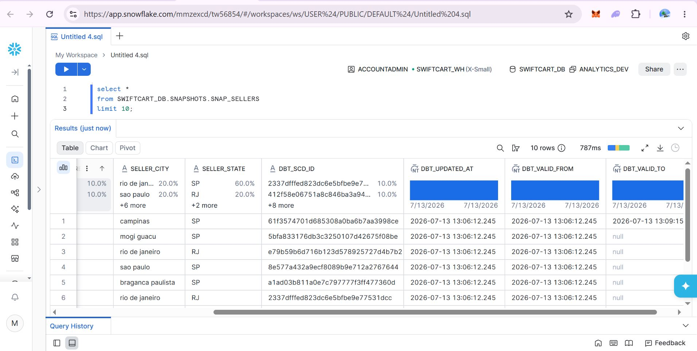
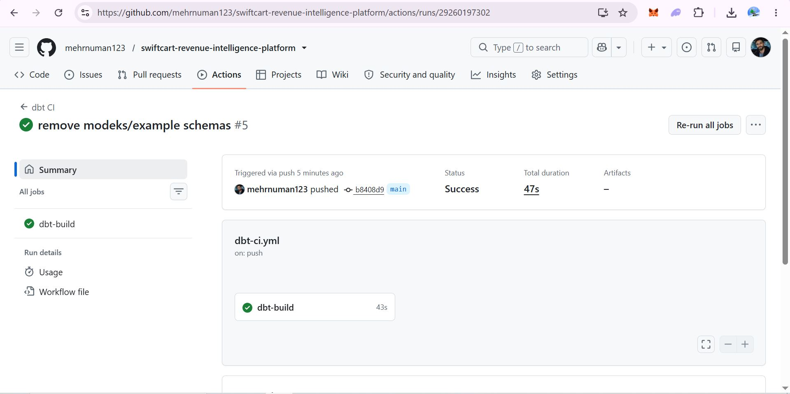
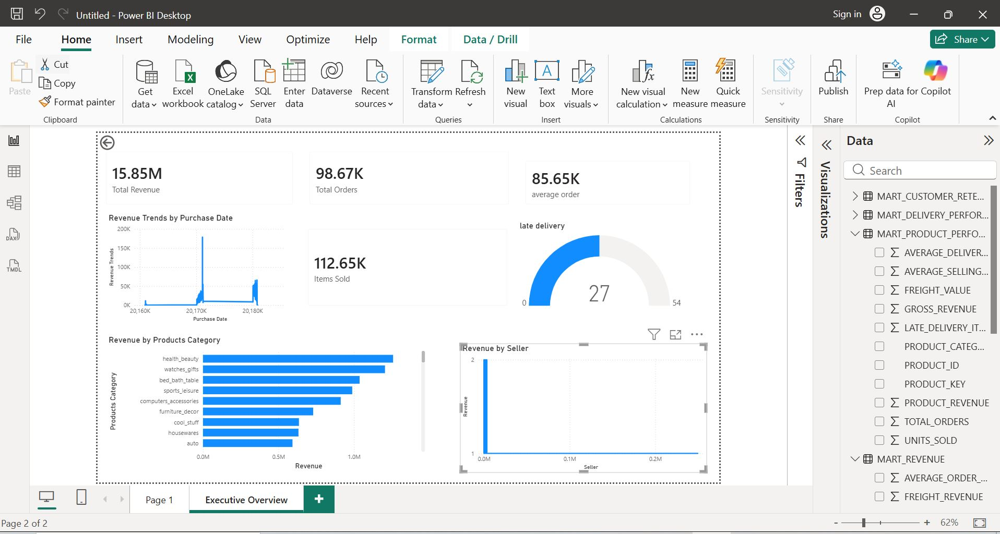

# 🚀 SwiftCart Revenue Intelligence Platform (snowflake, dbt)

A production level analytics project demonstrating how raw e-commerce data can be transformed into business-ready insights using **Snowflake**, **dbt**, **Power BI**, and **GitHub Actions**.

Instead of building a simple dashboard, this project follows an enterprise ELT architecture that models data into a dimensional warehouse, validates data quality, tracks historical changes, and delivers executive-ready analytics.

---

# Project Architecture

```
CSV Dataset
      │
      ▼
Snowflake RAW
      │
      ▼
dbt Staging
      │
      ▼
Intermediate Models
      │
      ▼
Dimensions & Facts
      │
      ▼
Business Marts
      │
      ▼
Power BI Dashboard
```

---

# Tech Stack

- Snowflake
- dbt Core
- SQL
- Power BI
- GitHub Actions
- Kimball Dimensional Modeling

---

# Features

- Enterprise ELT architecture
- Star Schema data warehouse
- Staging, Intermediate, Fact & Dimension layers
- Business-ready analytics marts
- Data quality testing
- Source freshness monitoring
- Slowly Changing Dimensions (SCD Type 2) using dbt Snapshots
- Incremental models
- GitHub Actions CI/CD
- Executive Power BI Dashboard

---

# Data Warehouse Architecture

```
RAW
 │
 ├── ORDERS
 ├── CUSTOMERS
 ├── PRODUCTS
 ├── SELLERS
 ├── PAYMENTS
 ├── REVIEWS
 └── GEOLOCATION

        │

STAGING

        │

INTERMEDIATE

        │

STAR SCHEMA

        ├── DIM_CUSTOMERS
        ├── DIM_PRODUCTS
        ├── DIM_SELLERS
        ├── DIM_DATE
        └── FACT_ORDER_ITEMS

        │

BUSINESS MARTS

        ├── MART_REVENUE
        ├── MART_PRODUCT_PERFORMANCE
        ├── MART_SELLER_PERFORMANCE
        ├── MART_CUSTOMER_RETENTION
        └── MART_DELIVERY_PERFORMANCE
```

---

# Project Structure

```
swiftcart-revenue-intelligence-platform
│
├── snowflake/
│   └── swiftcart_analytics/
│       ├── models/
│       ├── snapshots/
│       ├── tests/
│       ├── macros/
│       ├── dbt_project.yml
│       └── packages.yml
│
├── powerbi/
│   └── SwiftCart_Revenue_Intelligence.pbix
│
├── docs/
│
├── .github/
│   └── workflows/
│
└── README.md
```

---

# Data Flow

1. Load raw e-commerce dataset into Snowflake
2. Clean and standardize data using dbt Staging models
3. Build reusable Intermediate models
4. Create Kimball Star Schema (Facts & Dimensions)
5. Build Business Marts for analytics
6. Validate data using dbt Tests
7. Track historical changes using Snapshots
8. Monitor freshness of source tables
9. Execute CI/CD with GitHub Actions
10. Visualize insights in Power BI

---

# Screenshots

## 1. RAW Layer



---

## 2. Staging Models



---

## 3. Intermediate Model



---

## 4. Fact Table



---

## 5. Business Marts



---

## 6. Snapshot (SCD Type 2)



---

## 7. Snapshot History



---

## 8. GitHub Actions CI/CD



---

## 9. Executive Power BI Dashboard



---

# Business Dashboards

The project exposes analytics-ready marts that power executive reporting.

- Revenue Performance
- Product Performance
- Seller Performance
- Customer Retention
- Delivery Performance

---

# Key Data Engineering Concepts

- ELT Pipeline
- Analytics Engineering
- Kimball Dimensional Modeling
- Star Schema
- Incremental Models
- Data Quality Testing
- Source Freshness
- Slowly Changing Dimensions (SCD Type 2)
- CI/CD for dbt Projects
- Business Intelligence

---


---

# Author

**Muhammad Numan**

Backend Developer → Data Engineer

Open to Data Engineering and Analytics Engineering opportunities across Europe.
